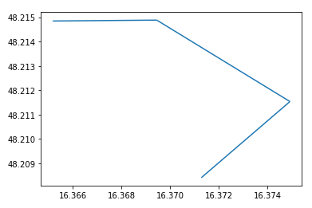
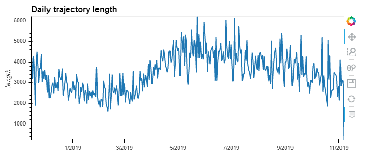

<p align="center">
  
</p>

MovingPandas is a Python library for handling movement data based on Pandas and [GeoPandas](https://geopandas.org). 
It provides trajectory data structures and functions for analysis and visualization.

The MovingPandas repository is hosted on [Github](https://github.com/anitagraser/movingpandas).

For more information on individual releases, check out the [Changelog](./changelog).

The official documentation is hosted on [ReadTheDocs](https://movingpandas.readthedocs.io).

For an example use case, check out our [movement data exploration tutorial](./3_horse_collar.html).


## Background

MovingPandas development started as a QGIS plugin idea in 2018. 
The resulting Trajectools plugin was first published in 2019. 
However, it became clear that the core trajectory handling classes should be extracted into 
in a separate library to make them usable outside the context of QGIS. 
This was the birth of MovingPandas.

In 2020, MovingPandas was approved for [pyOpenSci](https://www.pyopensci.org/).


## Features

* Convert GeoPandas GeoDataFrames of time-stamped points into MovingPandas Trajectories and TrajectoryCollections
* Add trajectory properties, such as movement speed and direction
* Split continuous observations into individual trips
* Generalize Trajectories 
* Aggregate TrajectoryCollections into flow maps
* Create static and interactive visualizations for data exploration

 


## Tutorials

The MovingPandas repository contains multiple tutorials in the form of Jupyter notebooks that 
illustrate diverse analysis capabilities using different datasets, including: tracking data of ships, 
migration of birds, and tracks from a horse's GPS collar. 
All MovingPandas tutorials are available on MyBinder - no installation required: 
[

MovingPandas Trajectory objects are created from GeoPandas GeoDataFrames. A minimal example would be:

```python
import pandas as pd
import geopandas as gpd
import movingpandas as mpd
from shapely.geometry import Point
from datetime import datetime
from pyproj import CRS

df = pd.DataFrame([
  {'geometry':Point(0,0), 't':datetime(2018,1,1,12,0,0)},
  {'geometry':Point(6,0), 't':datetime(2018,1,1,12,6,0)},
  {'geometry':Point(6,6), 't':datetime(2018,1,1,12,10,0)},
  {'geometry':Point(9,9), 't':datetime(2018,1,1,12,15,0)}
]).set_index('t')
gdf = gpd.GeoDataFrame(df, crs=CRS(31256))
traj = mpd.Trajectory(gdf, 1)
```

MovingPandas provides static plots using Matplotlib and interactive plots using hvplot:

```python
traj.plot()
```



Matplotlib and hvplot parameters are passed along to the underlying libraries to enable extensive customization of plots:

```python
traj.hvplot(geo=True, tiles='OSM', line_width=5, frame_width=300, frame_height=300)
```


### Exploring Movement Characteristics

MovingPandas makes it straightforward to compute movement characteristics, such as trajectory length and duration, as well as movement speed and direction.

For example, we can explore the daily travelled distance as recorded by a GPS tracker:

```python
df = read_file('tracker.gpkg')
df = df.set_index('t')
tc = mpd.TrajectoryCollection(df, 'CollarID')

daily = mpd.TemporalSplitter(tc).split(mode='day')
daily_lengths = [traj.get_length() for traj in daily]
daily_t = [traj.get_start_time() for traj in daily]
daily_lengths = pd.DataFrame(daily_lengths, index=daily_t, columns=['length'])
daily_lengths.hvplot(title='Daily trajectory length')
```



In this case, the movement data, which comes from a GPS collar of a horse, reveals that the animal tends to travel farther during summer days than during shorter winter days.  

Other functions deal with trajectory generalization, splitting trajectories into subtrajectories, clipping trajectories to an area of interest, and extracting trajectory start and end times and locations.


## What's next?

MovingPandas is under active development and there are some exciting features coming up. 
If you’d like to contribute to this project, you’re welcome to head on over to the [Github repo](https://github.com/anitagraser/movingpandas)! 


## Citation information

Please cite Graser (2019) when using MovingPandas in your research.

[Graser, A. (2019). MovingPandas: Efficient Structures for Movement Data in Python. GI_Forum ‒ Journal of Geographic Information Science 2019, 1-2019, 54-68. doi:10.1553/giscience2019_01_s54.](https://www.austriaca.at/rootcollection?arp=0x003aba2b)
