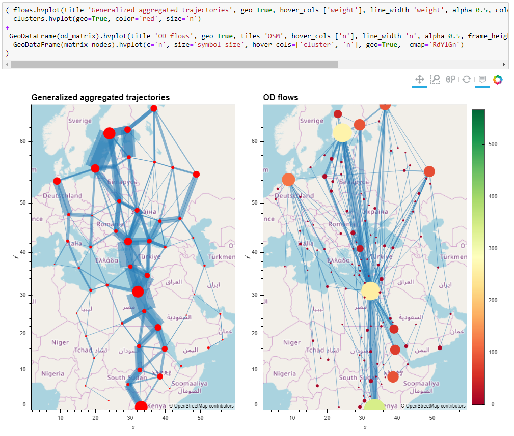

---
title: 'MovingPandas: A Python package for the analysis of movement data'
tags:
  - Python
  - spatial data
  - movement data
  - mobility
authors:
  - name: Anita Graser
    orcid: 0000-0001-5361-2885
    affiliation: "1, 2"
affiliations:
  - name: "AIT Austrian Institute of Technology, Vienna, Austria"
    index: 1
  - name: "University of Salzburg, Austria"
    index: 2
date: 3 March 2020
bibliography: paper.bib
---

# Summary & Purpose

`MovingPandas` is a package for dealing with movement data. Movement data appear in many different scientific domains, including biology, ecology, chemistry, transport and logistics, astrophysics, remote sensing, and more.

`MovingPandas` implements a Trajectory class and corresponding methods based on `GeoPandas`. A trajectory has a time-ordered series of point geometries. These points and associated attributes are stored in a GeoDataFrame. `MovingPandas` implements spatial and temporal data access and analysis functions (covered in [@graser:2019]) as well as plotting functions.

When researchers and data analysts are working with movement data, there are a suite of data exploration activities that are often performed including:

1. Creating and visualizing trajectories from consecutive time-stamped point location records
2. Computing and visualizing movement characteristics, such as time between records, speed, and direction
3. Extracting trip start and end locations, for example to generate origin destination matrices or filter by these location
4. Clipping trajectories to an area of interest, thus limiting the geographic extent of the analysis
5. Summarizing movements using aggregations, such as flow maps

The above operations are crucial to understanding a dataset and identifying issues that may need to be addressed with further data processing when beginning an analysis. However, there isn't a tool that makes these tasks easy for users in the `Python` open source package landscape.

# MovingPandas Tutorial Notebooks

In addition to detailed API documentation and example code executed by pytest, `MovingPandas` documentation includes multiple [tutorial notebooks](https://github.com/anitagraser/movingpandas/tree/master/tutorials) that demonstrate its functionality using case studies. 
These notebooks can be executed locally or online using [MyBinder](https://mybinder.org/v2/gh/anitagraser/movingpandas/binder-tag).
These tutorial notebooks document how to use `MovingPandas` to explore different types of movement datasets (including, for example, a day of vessel movements with high temporal resolution and multiple years of bird migration data with low temporal resolution).

# MovingPandas in Context

`MovingPandas`'s goal is to make working with movment data easier for scientists and data analysist who want to use open source `Python` tools for analysis and visualization.

`MovingPandas` depends upon `GeoPandas` [@kelsey_jordahl_2019_3545747], which facilitates reading and writing movement data from common spatial data formats. It also requires `Matplotlib` [@Hunter:2007] for static plots and `hvplot` [@philipp_rudiger_2020_3634720] for interactive plots.

To simplify dependency management and installation for non-experts, we maintain a version of `MovingPandas` on the `conda-forge` channel, which installs the system libraries upon which `MovingPandas` depends. This lowers the barrier to entry for people, particularly scientists, who are learning how to work with movement data in `Python`.

`scikit-mobility` [@pappalardo:2019] is a similar `Python` package which is in an early development stage and also deals with movement data. They implement TrajectoryDataFrames and FlowDataFrames on top of Pandas instead of GeoPandas. There is little overlap in the covered use cases and implemented functionality. `MovingPandas` focuses on spatio-temporal data exploration with corresponding functions for data manipulation and analysis. `scikit-mobility` on the other hand focuses on computing human mobility metrics, generating synthetic trajectories and assessing privacy risks.

# Acknowledgements

There have been many [contributors to MovingPandas](https://github.com/anitagraser/movingpandas/graphs/contributors) that we are thankful for. We are also thankful for the feedback that we recieved through the software review implemented by pyOpenSci. Specifically we thank Jenny Palomino who has served as an editor for this review and the two reviewers: Martin Fleischmann and Ivan Ogasawara.

# References