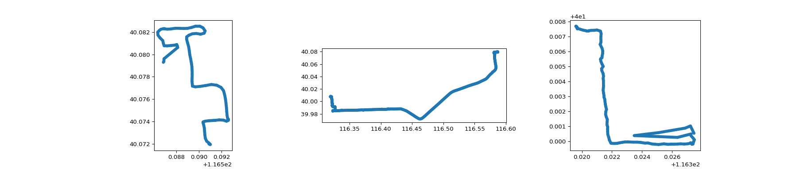
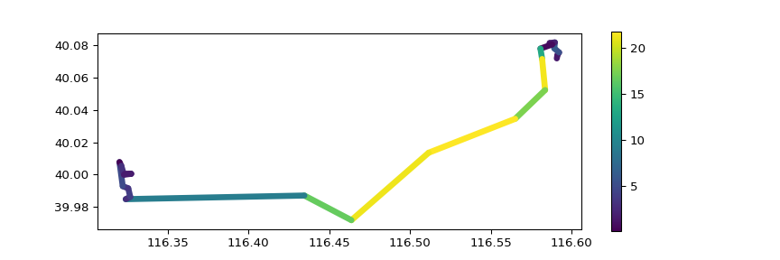
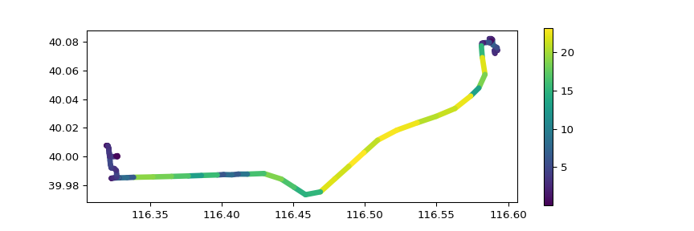

# Tutorial 0: Getting started with MovingPandas

MovingPandas provides a trajectory datatype based on GeoPandas. The
project home is at <https://github.com/anitagraser/movingpandas>

This tutorial presents some of the trajectory manipulation and
visualization functions implemented in MovingPandas.

After following this tutorial, you will have a basic understanding of
what MovingPandas is and what it can be used for. You’ll be ready to
dive into application examples presented in the the follow-up tutorials:
\* [Tutorial 1: Ship data analysis](1_ship_data_analysis.ipynb) \*
[Tutorial 2: Bird migration analysis](2_bird_migration_analysis.ipynb)

## Introduction

MovingPandas follows the **trajectories = timeseries with geometries**
approach of modeling movement data.

A MovingPandas trajectory can be interpreted as either a time series of
points or a time series of line segments. The line-based approach has
many advantages for trajectory analysis and visualization. (For more
detail, see e.g. Westermeier (2018))


### References

  - Graser, A. (2019). MovingPandas: Efficient Structures for Movement
    Data in Python. GI\_Forum ‒ Journal of Geographic Information
    Science 2019, 1-2019, 54-68. <doi:10.1553/giscience2019_01_s54>.
    URL: <https://www.austriaca.at/rootcollection?arp=0x003aba2b>
  - Westermeier, E.M. (2018). Contextual Trajectory Modeling and
    Analysis. Master Thesis, Interfaculty Department of Geoinformatics,
    University of Salzburg.

## Jupyter notebook setup

``` python
import urllib
import os
import pandas as pd
import contextily as ctx
from geopandas import GeoDataFrame, read_file
from shapely.geometry import Point, LineString, Polygon
from datetime import datetime, timedelta
from matplotlib import pyplot as plt

import sys
sys.path.append("..")
import movingpandas as mp

import warnings
warnings.simplefilter("ignore")
```

## Creating a trajectory from scratch

Trajectory objects consist of a trajectory ID and a GeoPandas
GeoDataFrame with a DatetimeIndex. The data frame therefore represents
the trajectory data as a Pandas time series with associated point
locations (and optional further attributes).

Let’s create a small toy trajectory to see how this works:

``` python
df = pd.DataFrame([
  {'geometry':Point(0,0), 't':datetime(2018,1,1,12,0,0)},
  {'geometry':Point(6,0), 't':datetime(2018,1,1,12,6,0)},
  {'geometry':Point(6,6), 't':datetime(2018,1,1,12,10,0)},
  {'geometry':Point(9,9), 't':datetime(2018,1,1,12,15,0)}
]).set_index('t')
geo_df = GeoDataFrame(df, crs={'init': '31256'})
toy_traj = mp.Trajectory(1, geo_df)
toy_traj.df
```

    ##                         geometry
    ## t                               
    ## 2018-01-01 12:00:00  POINT (0 0)
    ## 2018-01-01 12:06:00  POINT (6 0)
    ## 2018-01-01 12:10:00  POINT (6 6)
    ## 2018-01-01 12:15:00  POINT (9 9)

We can access **key information** about our trajectory by looking at the
print
    output:

``` python
print(toy_traj)
```

    ## Trajectory 1 (2018-01-01 12:00:00 to 2018-01-01 12:15:00) | Size: 4 | Length: 16.2m
    ## Bounds: (0.0, 0.0, 9.0, 9.0)
    ## LINESTRING (0 0, 6 0, 6 6, 9 9)

We can also access the trajectories GeoDataFrame:

``` python
toy_traj.df
```

    ##                         geometry
    ## t                               
    ## 2018-01-01 12:00:00  POINT (0 0)
    ## 2018-01-01 12:06:00  POINT (6 0)
    ## 2018-01-01 12:10:00  POINT (6 6)
    ## 2018-01-01 12:15:00  POINT (9 9)

## Visualizing trajectories

To **visualize the trajectory**, we can turn it into a linestring.

(The notebook environment automatically plots Shapely geometry objects
like the LineString returned by to\_linestring().)

``` python
toy_traj.to_linestring()
```

    ## <shapely.geometry.linestring.LineString object at 0x7fdb35f43668>

We can **compute the speed** of movement along the trajectory (between
consecutive points). The values are in meters per second:

``` python
toy_traj.add_speed(overwrite=True)
toy_traj.df
```

    ##                         geometry     speed
    ## t                                         
    ## 2018-01-01 12:00:00  POINT (0 0)  0.016667
    ## 2018-01-01 12:06:00  POINT (6 0)  0.016667
    ## 2018-01-01 12:10:00  POINT (6 6)  0.025000
    ## 2018-01-01 12:15:00  POINT (9 9)  0.014142

We can also visualize the speed
values:

``` python
toy_traj.plot(column="speed", linewidth=5, capstyle='round', legend=True)
```

<!-- -->

In contrast to the earlier example where we visualized the whole
trajectory as one linestring, the trajectory plot() function draws each
line segment individually and thus each can have a different color.

## Analyzing trajectories

MovingPandas provides many functions for trajectory analysis.

To see all available functions of the MovingPandas.Trajectory class
    use:

``` python
dir(mp.Trajectory)
```

    ## ['__class__', '__delattr__', '__dict__', '__dir__', '__doc__', '__eq__', '__format__', '__ge__', '__getattribute__', '__gt__', '__hash__', '__init__', '__init_subclass__', '__le__', '__lt__', '__module__', '__ne__', '__new__', '__reduce__', '__reduce_ex__', '__repr__', '__setattr__', '__sizeof__', '__str__', '__subclasshook__', '__weakref__', '_compute_distance', '_compute_heading', '_compute_speed', '_connect_prev_pt_and_geometry', '_to_line_df', 'add_direction', 'add_prev_pt', 'add_speed', 'apply_offset_minutes', 'apply_offset_seconds', 'clip', 'copy', 'generalize', 'generalize_douglas_peucker', 'generalize_min_time_delta', 'get_bbox', 'get_df_with_speed', 'get_direction', 'get_duration', 'get_end_location', 'get_end_time', 'get_length', 'get_linestring_between', 'get_position_at', 'get_row_at', 'get_segment_between', 'get_start_location', 'get_start_time', 'has_parent', 'interpolate_position_at', 'intersection', 'intersects', 'is_latlon', 'is_valid', 'plot', 'set_crs', 'split_by_date', 'split_by_observation_gap', 'to_linestring', 'to_linestringm_wkt']

Functions that start with an underscore (e.g. `__str__`) should not be
called directly. All other functions are free to use.

### Extracting a moving object’s position was at a certain time

For example, let’s have a look at the get\_position\_at()
    function:

``` python
help(mp.Trajectory.get_position_at)
```

    ## Help on function get_position_at in module movingpandas.trajectory:
    ## 
    ## get_position_at(self, t, method='interpolated')
    ##     Return shapely Point at given datetime using the provided method.

When we call this method, the resulting point is directly
rendered:

``` python
toy_traj.get_position_at(datetime(2018,1,1,12,6,0), method="nearest")    
```

    ## <shapely.geometry.point.Point object at 0x7fdb35f5d198>

To see its coordinates, we can look at the print
output:

``` python
print(toy_traj.get_position_at(datetime(2018,1,1,12,6,0), method="nearest"))
```

    ## POINT (6 0)

The method parameter describes what the function should do if there is
no entry in the trajectory GeoDataFrame for the specified timestamp.

For example, there is no entry at 2018-01-01 12:07:00

``` python
toy_traj.df
```

    ##                         geometry     speed
    ## t                                         
    ## 2018-01-01 12:00:00  POINT (0 0)  0.016667
    ## 2018-01-01 12:06:00  POINT (6 0)  0.016667
    ## 2018-01-01 12:10:00  POINT (6 6)  0.025000
    ## 2018-01-01 12:15:00  POINT (9 9)  0.014142

``` python
print(toy_traj.get_position_at(datetime(2018,1,1,12,7,0), method="nearest"))
```

    ## POINT (6 0)

``` python
print(toy_traj.get_position_at(datetime(2018,1,1,12,7,0), method="interpolated"))
```

    ## POINT (6 1.5)

``` python
print(toy_traj.get_position_at(datetime(2018,1,1,12,7,0), method="ffill")) # from the previous row
```

    ## POINT (6 0)

``` python
print(toy_traj.get_position_at(datetime(2018,1,1,12,7,0), method="bfill")) # from the following row
```

    ## POINT (6 6)

### Extracting trajectory segments based on time or geometry (i.e. clipping)

First, let’s extract the trajectory segment for a certain time
period:

``` python
segment = toy_traj.get_segment_between(datetime(2018,1,1,12,6,0),datetime(2018,1,1,12,12,0))
print(segment)
```

    ## Trajectory 1 (2018-01-01 12:06:00 to 2018-01-01 12:10:00) | Size: 2 | Length: 6.0m
    ## Bounds: (6.0, 0.0, 6.0, 6.0)
    ## LINESTRING (6 0, 6 6)

Now, let’s extract the trajectory segment that intersects with a given
polygon:

``` python
xmin, xmax, ymin, ymax = 2, 8, -10, 5
polygon = Polygon([(xmin, ymin), (xmin, ymax), (xmax, ymax), (xmax, ymin), (xmin, ymin)])
polygon
```

    ## <shapely.geometry.polygon.Polygon object at 0x7fdb36211400>

``` python
intersections = toy_traj.clip(polygon)
print(intersections[0])
```

    ## Trajectory 1_0 (2018-01-01 12:02:00 to 2018-01-01 12:09:20) | Size: 3 | Length: 9.0m
    ## Bounds: (2.0, 0.0, 6.0, 5.0)
    ## LINESTRING (2 0, 6 0, 6 5)

``` python
intersections[0].plot(linewidth=5, capstyle='round')
```

<!-- -->

## Beyond toy trajectories: loading trajectory data from GeoPackage

The MovingPandas repository contains a demo GeoPackage file that can be
loaded as
follows:

``` python
url = 'https://github.com/anitagraser/movingpandas/raw/master/tutorials/data/demodata_geolife.gpkg'
filename = url.split('/')[-1] 

response = urllib.request.urlopen(url)
content = response.read()
with open(filename, 'wb' ) as f:
    f.write( content )
```

    ## 991232

``` python
assert(os.path.exists(filename))
```

Now, we can use GeoPandas’ read\_file() function to read the GeoPackage
and construct the Trajectories:

``` python
t_start = datetime.now()
df = read_file(filename)
df['t'] = pd.to_datetime(df['t'])
df = df.set_index('t').tz_localize(None)
print("Finished reading {} rows in {}".format(len(df),datetime.now() - t_start))
```

    ## Finished reading 5908 rows in 0:00:00.249109

``` python
t_start = datetime.now()
trajectories = []
for key, values in df.groupby(['trajectory_id']):
    trajectory = mp.Trajectory(key, values)
    print(trajectory)
    trajectories.append(trajectory)
```

    ## Trajectory 1 (2008-12-11 04:42:14 to 2008-12-11 05:15:46) | Size: 466 | Length: 6210.1m
    ## Bounds: (116.385602, 39.862378, 116.393553, 39.898723)
    ## LINESTRING (116.391305 39.898573, 116.391317 39.898617, 116.390928 39.898613, 116.390833 39.898635, 
    ## Trajectory 2 (2009-06-29 07:02:25 to 2009-06-29 11:13:12) | Size: 897 | Length: 38728.7m
    ## Bounds: (116.319212, 39.971703, 116.592616, 40.082514)
    ## LINESTRING (116.590957 40.071961, 116.590905 40.072007, 116.590879 40.072027, 116.590915 40.072004, 
    ## Trajectory 3 (2009-02-04 04:32:53 to 2009-02-04 11:20:12) | Size: 1810 | Length: 12739.2m
    ## Bounds: (116.332706, 39.897023, 116.387307, 39.927949)
    ## LINESTRING (116.385689 39.899773, 116.385654 39.899651, 116.385548 39.899699, 116.385527 39.899632, 
    ## Trajectory 4 (2009-03-10 10:36:45 to 2009-03-10 12:01:07) | Size: 1864 | Length: 14357.6m
    ## Bounds: (116.327347, 39.896671, 116.389611, 39.927947)
    ## LINESTRING (116.388053 39.903418, 116.388042 39.9035, 116.388035 39.903467, 116.388061 39.903541, 11
    ## Trajectory 5 (2009-02-25 09:47:03 to 2009-02-25 14:31:24) | Size: 871 | Length: 39289.3m
    ## Bounds: (116.294527, 39.89825, 116.38552, 40.052399)
    ## LINESTRING (116.385256 39.90027, 116.38525 39.900222, 116.385374 39.900249, 116.385368 39.900264, 11

``` python
print("Finished creating {} trajectories in {}".format(len(trajectories),datetime.now() - t_start))
```

    ## Finished creating 5 trajectories in 0:00:00.895185

Let’s look at one of those
trajectories:

``` python
trajectories[1].plot(column='speed', linewidth=5, capstyle='round', figsize=(9,3), legend=True)
```

<!-- -->

``` r
# trajectories[1].plot(with_basemap=True, linewidth=5.0, capstyle='round', figsize=(9,9))
```

### Finding intersections with a Shapely polygon

``` python
xmin, xmax, ymin, ymax = 116.3685035,116.3702945,39.904675,39.907728
polygon = Polygon([(xmin,ymin), (xmin,ymax), (xmax,ymax), (xmax,ymin), (xmin,ymin)])

intersections = []
for traj in trajectories:
    for intersection in traj.clip(polygon):
        intersections.append(intersection)
print("Found {} intersections".format(len(intersections)))
```

    ## Found 3 intersections

``` python
intersections[2].plot(linewidth=5.0, capstyle='round')
```

<!-- -->

## Splitting trajectories

Gaps are quite common in trajectories. For example, GPS tracks may
contain gaps if moving objects enter tunnels where GPS reception is
lost. In other use cases, moving objects may leave the observation area
for longer time before returning and continuing their recorded track.

Depending on the use case, we therefore might want to split trajectories
at observation gaps that exceed a certain minimum duration:

``` python
my_traj = trajectories[1]
print(my_traj)
```

    ## Trajectory 2 (2009-06-29 07:02:25 to 2009-06-29 11:13:12) | Size: 897 | Length: 38728.7m
    ## Bounds: (116.319212, 39.971703, 116.592616, 40.082514)
    ## LINESTRING (116.590957 40.071961, 116.590905 40.072007, 116.590879 40.072027, 116.590915 40.072004,

``` python
my_traj.plot(linewidth=5.0, capstyle='round')
```

<!-- -->

``` python
split = my_traj.split_by_observation_gap(timedelta(minutes=5))
for traj in split:
    print(traj)
```

    ## Trajectory 2_0 (2009-06-29 07:02:25 to 2009-06-29 07:17:05) | Size: 152 | Length: 2554.1m
    ## Bounds: (116.586342, 40.07196, 116.592616, 40.082514)
    ## LINESTRING (116.590957 40.071961, 116.590905 40.072007, 116.590879 40.072027, 116.590915 40.072004, 
    ## Trajectory 2_1 (2009-06-29 07:29:35 to 2009-06-29 08:20:15) | Size: 619 | Length: 33733.3m
    ## Bounds: (116.319212, 39.971703, 116.587085, 40.079854)
    ## LINESTRING (116.587031 40.07951, 116.587041 40.079514, 116.587032 40.079524, 116.586998 40.079528, 1
    ## Trajectory 2_2 (2009-06-29 10:57:17 to 2009-06-29 11:13:12) | Size: 126 | Length: 2326.4m
    ## Bounds: (116.319598, 39.999772, 116.327485, 40.007696)
    ## LINESTRING (116.319697 40.007513, 116.319706 40.007586, 116.319636 40.007687, 116.319598 40.007696,

``` python
fig, axes = plt.subplots(nrows=1, ncols=len(split), figsize=(19,4))
for i, traj in enumerate(split):
    traj.plot(ax=axes[i], linewidth=5.0, capstyle='round')
```

<!-- -->

## Generalizing trajectories

To reduce the size of trajectory objects, we can generalize them, for
example, using the Douglas-Peucker algorithm:

``` python
original_traj = trajectories[1]
print(original_traj)
```

    ## Trajectory 2 (2009-06-29 07:02:25 to 2009-06-29 11:13:12) | Size: 897 | Length: 38728.7m
    ## Bounds: (116.319212, 39.971703, 116.592616, 40.082514)
    ## LINESTRING (116.590957 40.071961, 116.590905 40.072007, 116.590879 40.072027, 116.590915 40.072004,

``` python
original_traj.plot(column='speed', linewidth=5, capstyle='round', figsize=(9,3), legend=True)
```

<!-- -->

Try different tolerance settings and observe the results in line
geometry and therefore also
length:

``` python
generalized_traj = original_traj.generalize(mode='douglas-peucker', tolerance=0.001)
generalized_traj.plot(column='speed', linewidth=5, capstyle='round', figsize=(9,3), legend=True)
```

<!-- -->

``` python
print('Original length: %s'%(original_traj.get_length()))
```

    ## Original length: 38728.7215399247

``` python
print('Generalized length: %s'%(generalized_traj.get_length()))
```

    ## Generalized length: 36295.61630501229

An alternative generalization method is to down-sample the trajectory to
ensure a certain time delta between
records:

``` python
time_generalized = original_traj.generalize(mode='min-time-delta', tolerance=timedelta(minutes=1))
time_generalized.plot(column='speed', linewidth=5, capstyle='round', figsize=(9,3), legend=True)
```

<!-- -->

``` python
time_generalized.df.head(10)
```

    ##                        id  sequence  ...  tracker                      geometry
    ## t                                    ...                                       
    ## 2009-06-29 07:02:25  1556      1090  ...        0  POINT (116.590957 40.071961)
    ## 2009-06-29 07:03:25  1569      1103  ...        0  POINT (116.590686 40.072249)
    ## 2009-06-29 07:04:25  1582      1116  ...        0  POINT (116.590368 40.073956)
    ## 2009-06-29 07:05:25  1595      1129  ...        0  POINT (116.592604 40.074115)
    ## 2009-06-29 07:06:25  1610      1144  ...        0  POINT (116.592585 40.074198)
    ## 2009-06-29 07:07:25  1623      1157  ...        0  POINT (116.592349 40.076016)
    ## 2009-06-29 07:08:25  1635      1169  ...        0  POINT (116.589395 40.077941)
    ## 2009-06-29 07:09:25  1647      1181  ...        0   POINT (116.589112 40.08171)
    ## 2009-06-29 07:10:25  1659      1193  ...        0  POINT (116.588289 40.082325)
    ## 2009-06-29 07:11:25  1672      1206  ...        0   POINT (116.58689 40.082299)
    ## 
    ## [10 rows x 5 columns]

``` python
original_traj.df.head(10)
```

    ##                        id  sequence  ...  tracker                      geometry
    ## t                                    ...                                       
    ## 2009-06-29 07:02:25  1556      1090  ...        0  POINT (116.590957 40.071961)
    ## 2009-06-29 07:02:30  1557      1091  ...        0  POINT (116.590905 40.072007)
    ## 2009-06-29 07:02:35  1558      1092  ...        0  POINT (116.590879 40.072027)
    ## 2009-06-29 07:02:40  1559      1093  ...        0  POINT (116.590915 40.072004)
    ## 2009-06-29 07:02:45  1560      1094  ...        0  POINT (116.590961 40.071983)
    ## 2009-06-29 07:02:50  1561      1095  ...        0   POINT (116.591012 40.07196)
    ## 2009-06-29 07:02:55  1562      1096  ...        0  POINT (116.590986 40.071984)
    ## 2009-06-29 07:03:00  1563      1097  ...        0  POINT (116.590975 40.071993)
    ## 2009-06-29 07:03:05  1564      1098  ...        0  POINT (116.590973 40.071995)
    ## 2009-06-29 07:03:10  1565      1099  ...        0  POINT (116.590971 40.071996)
    ## 
    ## [10 rows x 5 columns]

## Continue exploring MovingPandas

  - [Tutorial 1: Ship data analysis](1_ship_data_analysis.ipynb)
  - [Tutorial 2: Bird migration
    analysis](2_bird_migration_analysis.ipynb)
